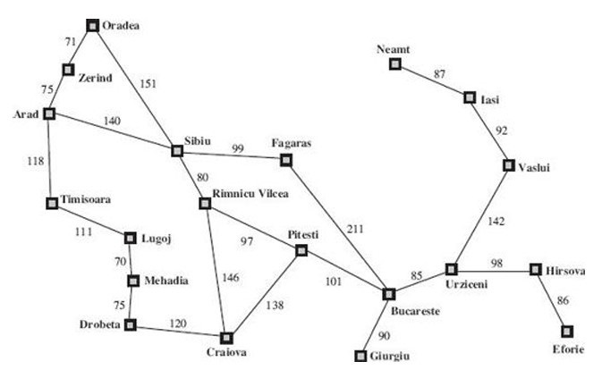

<div align="center" style="display: inline_block">
  
  <!-- 
   -->
  
</div>

<br>
<!-- <h1 align="center">
    <a>
        
    </a>
</h1> -->

## 🗂️ Estrutura do Repositório

- `report/`: Diretório contendo o relatório do projeto em formato LaTeX.
- `src/`: Diretório com os scripts Python usados para gerar os percursos do agente e realizar as análises.
- `imgs/`: Diretório com as imagens utilizadas no relatório e repositório.

## 📝 Resumo

<p align="center">
 
</p>
<p align="center">
<em>Figura 1: Mapa rodoviário simplificado de parte da Romênia [Russell and Norvig 2010].</em>
</p>

<div align="justify">
Este trabalho apresenta o desenvolvimento e a análise de diferentes algoritmos de busca aplicados ao problema de planejamento de rotas em um grafo. O principal algoritmo utilizado é o <code>A*</code>, que faz uso de três heurísticas distintas: a distância em linha reta (<code>hDLR</code>), a distância Euclidiana e a distância Manhattan. Esses métodos heurísticos são avaliados quanto ao impacto no desempenho do <code>A*</code>, principalmente em termos de tempo de execução e número de nós explorados. Para comparação, também são implementados dois algoritmos de busca não informada: a Busca em Largura (<code>BFS</code>) e a Busca em Profundidade (<code>DFS</code>). O cenário de aplicação envolve o mapa das cidades da Romênia, onde o objetivo é encontrar o menor caminho entre as cidades de <code>Arad</code> e <code>Bucareste</code>. Os resultados demonstram a importância da escolha de heurísticas para a eficiência do <code>A*</code>, assim como uma análise comparativa entre os métodos informados e não informados em termos de precisão e desempenho.
</div>

## 🔄 Compilação e Execução 

<div align="justify">
Para executar o programa, siga os passos abaixo:

- Abra o terminal no diretório onde os arquivos do projeto estão localizados.
- Certifique-se de que as bibliotecas `networkx` e `matplotlib` estão instaladas. Se não estiverem instaladas, você pode instalar essas bibliotecas manualmente utilizando o seguinte comando:

```bash
pip install networkx matplotlib 
```

- Em seguida, execute o programa com o comando:

```bash
python main.py
```

Isso irá executar o arquivo `main.py`, que automaticamente rodará todos os algoritmos de busca e exibirá os resultados no terminal e as visualizações gráficas na tela.
</div>

## 📞 Contato

<table align="center">
  <tr>
    <th>Participante</th>
    <th>Contato</th>
  </tr>
  <tr>
    <td>Celso</td>
    <td><a href="https://t.me/celso_vsf"> </td>
  </tr>
</table>